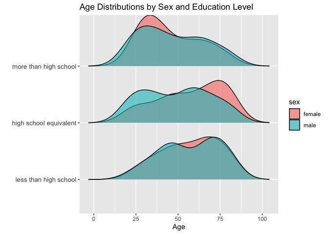
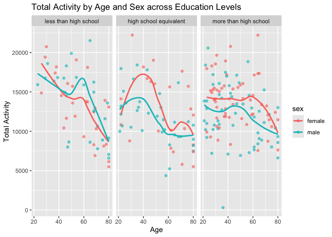

p8105_hw3_bk2959
================
Stella Koo
2024-10-08

## Problem 2

``` r
library(tidyverse)

covar_df = read_csv("./nhanes_covar.csv", skip = 4, na = c("NA")) |>
  janitor::clean_names() |>
  mutate(
    sex = 
      case_match(
        sex, 
        1 ~ "male", 
        2 ~ "female"
    ),
    sex = as.factor(sex), 
    education =
      case_match(
        education,
        1 ~ "less than high school",
        2 ~ "high school equivalent",
        3 ~ "more than high school"
    ),
    education = factor(education, levels = c("less than high school", "high school equivalent", "more than high school"))
    ) |>
  filter(age >= 21) |>
  drop_na()
  
accel_df = read_csv("./nhanes_accel.csv") |>
  janitor::clean_names()
```

``` r
merged_df = inner_join(covar_df, accel_df, by = "seqn")
```

``` r
edu_sex_counts = merged_df |>
  group_by(sex, education) |>
  summarize(count = n()) |>
  select(education, sex, count) |>
  knitr::kable()

edu_sex_counts
```

| education              | sex    | count |
|:-----------------------|:-------|------:|
| less than high school  | female |    28 |
| high school equivalent | female |    23 |
| more than high school  | female |    59 |
| less than high school  | male   |    27 |
| high school equivalent | male   |    35 |
| more than high school  | male   |    56 |

The count data provides valuable insights into educational attainment by
`sex`. Notably, females slightly outnumber males in the
`more than high school` category (59 vs. 56) and also maintain a small
lead in the `less than high school` category (28 vs. 27). The highest
total count is found in the `more than high school` category, indicating
a significant trend toward higher educational attainment. Conversely,
the `high school equivalent` category shows the lowest counts,
particularly among females (23). These patterns suggest that a
substantial number of both sexes are advancing their education beyond
high school.

``` r
library(ggridges)

age_distributions = merged_df |>
  ggplot(aes(x = age, y = education, fill = sex)) +
  geom_density_ridges(alpha = 0.6, scale = 0.9) +
  labs(title = "Age Distributions by Sex and Education Level", 
       x = "Age",
       y = "")

age_distributions
```

<!-- --> The
plot illustrates the age distributions by sex within each education
category. In the `more than high school` category, both female and male
distributions are right-skewed, indicating a greater proportion of
younger individuals attaining higher education. In the
`high school equivalent` category, there is a clear difference between
the sexes: the female distribution is left-skewed, reflecting more older
individuals, while the male distribution is slightly right-skewed, with
a higher proportion of middle-aged and younger individuals. In the
`less than high school` category, the distributions are quite similar
between the sexes; however, the female distribution is slightly
left-skewed, suggesting a larger proportion of older individuals. The
male distribution shows two distinct peaks: one around ages 38 to 50 and
another between 65 and 80, with a slightly higher concentration of older
individuals. The data, thus, suggests a trend of younger individuals
attaining higher levels of education, while older individuals,
particularly females, are more likely to fall into lower education
categories.

``` r
total_activity_df = merged_df |>
  mutate(total_activity = rowSums(select(merged_df, starts_with("min"))))

total_activity_plot = total_activity_df |>
  ggplot(aes(x = age, y = total_activity, color = sex)) +
  geom_point(alpha = 0.6) +
  geom_smooth(se = FALSE) +
  facet_grid(~education) +
  labs(title = "Total Activity by Age and Sex across Education Levels",
       x = "Age",
       y = "Total Activity")

total_activity_plot
```

<!-- --> The
plot illustrates total activity levels by age, categorized by sex and
education level. Within each education category, both females and males
exhibit similar patterns. For individuals with `less than high school`
education, both sexes experience a decline in activity until around age
50, followed by a slight increase afterwards, with males showing a more
pronounced rise. After this period, activity levels begin to decline
again.

In the `high school equivalent` group, total activity increases until
approximately age 40, with females experiencing a more significant rise.
However, activity then decreases sharply until age 60. For males,
activity levels plateau during this time, while females show a slight
increase before decreasing again.

For those with `more than high school` education, both the decreases and
increases in activity are considerably less pronounced compared to the
other two education categories, with a more substantial decline observed
in total activity around the late 60s. This data suggests that
individuals with higher education experience less severe declines in
total activity compared to those with lower educational attainment.

``` r
inspection_df = merged_df |>
  pivot_longer(cols = starts_with("min"),
               names_to = "minute",
               names_prefix = "min",
               values_to = "activity") |>
  group_by(minute, sex, education) |>
  summarize(avg_activity = mean(activity)) |>
  mutate(minute = as.numeric(minute))

inspection_plot = inspection_df |>
  ggplot(aes(x = minute, y = avg_activity, color = sex)) +
  geom_point(alpha = 0.15) +
  geom_smooth() +
  facet_grid(~education) +
  labs(title = "24-Hour Activity by Sex across Education Levels", 
       x = "Minute of the Day",
       y = "Average Activity") 

inspection_plot
```

<!-- --> The
plot illustrates the 24-hour activity patterns categorized by sex across
three education levels. Across all education categories, a consistent
trend is observed:

- **Early Morning Activity (0 to 250 minutes)**: Average activity
  slightly decreases from 0 minutes (12:00 AM) to 250 minutes
  (approximately 4:10 AM). This decline suggests lower engagement in
  activities during the early hours of the day, possibly indicating a
  period of rest or sleep.
- **Mid-Morning Surge (250 to 750 minutes):** Activity levels then
  experience a drastic increase, peaking around 750 minutes
  (approximately 12:30 PM). This surge likely corresponds to the start
  of daily routines, such as commuting, work, and other daytime
  activities.
- **Mid-day Stability (750 to 1250 minutes):** After reaching the peak,
  activity levels show oscillating but minimal changes until around 1250
  minutes (approximately 9:10 PM). This stability suggests a consistent
  level of engagement throughout the day, reflecting ongoing work or
  social activities.
- **Evening Decline (1250 minutes to end of day):** Activity decreases
  drastically as the day approaches its end, indicating a return to more
  sedentary behaviors during the evening hours.

Overall, men exhibit lower average activity levels than females across
all three education categories. However, the difference is particularly
pronounced among individuals with education `more than high school`.
This suggests that higher educational attainment may correlate with
increased activity levels for females compared to their male
counterparts.

Among the education levels analyzed, individuals `less than high school`
demonstrate a more significant decrease in activity during the mid-day
stability phase (from approximately 750 to 1250 minutes). In contrast,
individuals with education levels `equivalent or more than high school`
show a more plateaued activity pattern during the same time period. This
steadiness suggests that those with higher educational backgrounds are
likely to maintain a more stable level of activity, potentially due to
structured daily routines.

## Problem 3
