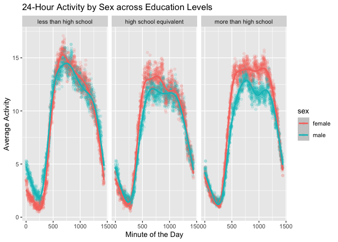
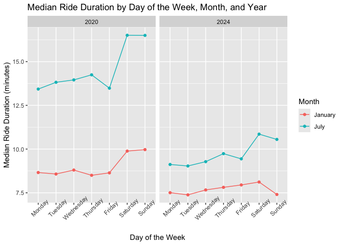
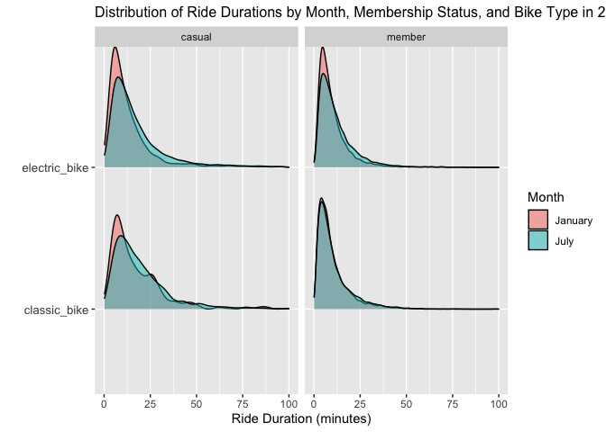

p8105_hw3_bk2959
================
Stella Koo
2024-10-08

## Problem 1

``` r
library(p8105.datasets)
data("ny_noaa")
```

The data consists of 2595176 and 7. Key variables include: `id` (station
identifier), `date`, `prcp` (daily precipitation), `snwd` (snowfall in
mm), `tmax` & `tmin` (maximum and minimum temperature). The dataset has
significant missing values, particularly for temperature, snowfall, and
snow depth, which may require data cleaning or imputation for analysis.

``` r
library(tidyverse)

ny_noaa |>
  mutate(year = year(date),
    month = month(date),
    day = day(date),
    tmax = as.numeric(tmax) / 10,
    tmin = as.numeric(tmin) / 10,
    prcp = prcp / 10,  
    snow = snow / 10)
```

    ## # A tibble: 2,595,176 × 10
    ##    id          date        prcp  snow  snwd  tmax  tmin  year month   day
    ##    <chr>       <date>     <dbl> <dbl> <int> <dbl> <dbl> <dbl> <dbl> <int>
    ##  1 US1NYAB0001 2007-11-01    NA    NA    NA    NA    NA  2007    11     1
    ##  2 US1NYAB0001 2007-11-02    NA    NA    NA    NA    NA  2007    11     2
    ##  3 US1NYAB0001 2007-11-03    NA    NA    NA    NA    NA  2007    11     3
    ##  4 US1NYAB0001 2007-11-04    NA    NA    NA    NA    NA  2007    11     4
    ##  5 US1NYAB0001 2007-11-05    NA    NA    NA    NA    NA  2007    11     5
    ##  6 US1NYAB0001 2007-11-06    NA    NA    NA    NA    NA  2007    11     6
    ##  7 US1NYAB0001 2007-11-07    NA    NA    NA    NA    NA  2007    11     7
    ##  8 US1NYAB0001 2007-11-08    NA    NA    NA    NA    NA  2007    11     8
    ##  9 US1NYAB0001 2007-11-09    NA    NA    NA    NA    NA  2007    11     9
    ## 10 US1NYAB0001 2007-11-10    NA    NA    NA    NA    NA  2007    11    10
    ## # ℹ 2,595,166 more rows

``` r
common_snowfall = ny_noaa |>
  filter(snow > 0) |>
  count(snow) |>
  arrange(desc(n))
```

## Problem 2

### Joining datasets

``` r
library(tidyverse)

covar_df = read_csv("./nhanes_covar.csv", skip = 4, na = c("NA")) |>
  janitor::clean_names() |>
  mutate(
    sex = 
      case_match(
        sex, 
        1 ~ "male", 
        2 ~ "female"
    ),
    sex = as.factor(sex), 
    education =
      case_match(
        education,
        1 ~ "less than high school",
        2 ~ "high school equivalent",
        3 ~ "more than high school"
    ),
    education = factor(education, levels = c("less than high school", "high school equivalent", "more than high school"))
    ) |>
  filter(age >= 21) |>
  drop_na()
  
accel_df = read_csv("./nhanes_accel.csv") |>
  janitor::clean_names()
```

``` r
merged_df = inner_join(covar_df, accel_df, by = "seqn")
```

### Number of men and women in each education category

``` r
edu_sex_counts = merged_df |>
  group_by(sex, education) |>
  summarize(count = n()) |>
  select(education, sex, count) |>
  knitr::kable()

edu_sex_counts
```

| education              | sex    | count |
|:-----------------------|:-------|------:|
| less than high school  | female |    28 |
| high school equivalent | female |    23 |
| more than high school  | female |    59 |
| less than high school  | male   |    27 |
| high school equivalent | male   |    35 |
| more than high school  | male   |    56 |

The count data provides valuable insights into educational levels by
`sex`. Notably, females slightly outnumber males in the
`more than high school` category (59 vs. 56) and also maintain a small
lead in the `less than high school` category (28 vs. 27). The highest
total count is found in the `more than high school` category, indicating
a significant trend toward higher educational attainment. Conversely,
the `high school equivalent` category shows the lowest counts,
particularly among females (23). These patterns suggest that a
substantial number of both sexes are advancing their education beyond
high school.

### Age Distributions by Sex and Education Level

``` r
library(ggridges)

age_distributions = merged_df |>
  ggplot(aes(x = age, y = education, fill = sex)) +
  geom_density_ridges(alpha = 0.6, scale = 0.9) +
  labs(title = "Age Distributions by Sex and Education Level", 
       x = "Age",
       y = "") +
  theme(axis.text.y = element_text(size = 10))

age_distributions
```

<!-- -->

The plot illustrates the age distributions by sex within each education
category. In the `more than high school` category, both female and male
distributions are right-skewed, indicating a greater proportion of
younger individuals attaining higher education. In the
`high school equivalent` category, there is a clear difference between
the sexes: the female distribution is left-skewed, reflecting more older
individuals, while the male distribution is slightly right-skewed, with
a higher proportion of middle-aged and younger individuals. In the
`less than high school` category, the distributions are quite similar
between the sexes; however, the female distribution is slightly
left-skewed, suggesting a larger proportion of older individuals. The
male distribution shows two distinct peaks: one around ages 38 to 50 and
another between 65 and 80, with a slightly higher concentration of older
individuals. The data, thus, suggests a trend of younger individuals
attaining higher levels of education, while older individuals,
particularly females, are more likely to fall into lower education
categories.

### Total Activity by Age and Sex across Education Levels

``` r
total_activity_df = merged_df |>
  mutate(total_activity = rowSums(select(merged_df, starts_with("min"))))

total_activity_plot = total_activity_df |>
  ggplot(aes(x = age, y = total_activity, color = sex)) +
  geom_point(alpha = 0.6) +
  geom_smooth(se = FALSE) +
  facet_grid(~education) +
  labs(title = "Total Activity by Age and Sex across Education Levels",
       x = "Age",
       y = "Total Activity")

total_activity_plot
```

<!-- -->

The plot illustrates total activity levels by age, categorized by sex
and education level. Within each education category, both females and
males exhibit similar patterns. For individuals with
`less than high school` education, both sexes experience a decline in
activity until around age 50, followed by a slight increase afterwards,
with males showing a more pronounced rise. After this period, activity
levels begin to decline again.

In the `high school equivalent` group, total activity increases until
approximately age 40, with females experiencing a more significant rise.
However, activity then decreases sharply until age 60. For males,
activity levels plateau during this time, while females show a slight
increase before decreasing again.

For those with `more than high school` education, both the decreases and
increases in activity are considerably less pronounced compared to the
other two education categories, with a more substantial decline observed
in total activity around the late 60s. This data suggests that
individuals with higher education experience less severe declines in
total activity compared to those with lower educational attainment.

### 24-Hour Activity by Sex across Education Levels

``` r
inspection_df = merged_df |>
  pivot_longer(cols = starts_with("min"),
               names_to = "minute",
               names_prefix = "min",
               values_to = "activity") |>
  group_by(minute, sex, education) |>
  summarize(avg_activity = mean(activity)) |>
  mutate(minute = as.numeric(minute))

inspection_plot = inspection_df |>
  ggplot(aes(x = minute, y = avg_activity, color = sex)) +
  geom_point(alpha = 0.15) +
  geom_smooth() +
  facet_grid(~education) +
  labs(title = "24-Hour Activity by Sex across Education Levels", 
       x = "Minute of the Day",
       y = "Average Activity") 

inspection_plot
```

<!-- -->

The plot illustrates the 24-hour activity patterns categorized by sex
across three education levels. Across all education categories, a
consistent trend is observed:

- **Early Morning Activity (0 to 250 minutes)**: Average activity
  slightly decreases from 0 minutes (12:00 AM) to 250 minutes
  (approximately 4:10 AM). This decline suggests lower engagement in
  activities during the early hours of the day, possibly indicating a
  period of rest or sleep.
- **Mid-Morning Surge (250 to 750 minutes):** Activity levels then
  experience a drastic increase, peaking around 750 minutes
  (approximately 12:30 PM). This surge likely corresponds to the start
  of daily routines, such as commuting, work, and other daytime
  activities.
- **Mid-day Stability (750 to 1250 minutes):** After reaching the peak,
  activity levels show oscillating but minimal changes until around 1250
  minutes (approximately 9:10 PM). This stability suggests a consistent
  level of engagement throughout the day, reflecting ongoing work or
  social activities.
- **Evening Decline (1250 minutes to end of day):** Activity decreases
  drastically as the day approaches its end, indicating a return to more
  sedentary behaviors during the evening hours.

Overall, men exhibit lower average activity levels than females across
all three education categories. However, the difference is particularly
pronounced among individuals with education `more than high school`.
This suggests that higher educational attainment may correlate with
increased activity levels for females compared to their male
counterparts.

Among the education levels analyzed, individuals `less than high school`
demonstrate a more significant decrease in activity during the mid-day
stability phase (from approximately 750 to 1250 minutes). In contrast,
individuals with education levels `equivalent or more than high school`
show a more plateaued activity pattern during the same time period. This
steadiness suggests that those with higher educational backgrounds are
likely to maintain a more stable level of activity, potentially due to
structured daily routines.

## Problem 3

### Combining datasets

``` r
jan2020 = read_csv("./citibike/jan2020.csv") |>
  janitor::clean_names() |>
  mutate(month = "January",
         year = "2020")

july2020 = read_csv("./citibike/july2020.csv") |>
  janitor::clean_names() |>
    mutate(month = "July",
         year = "2020")

jan2024 = read_csv("./citibike/jan2024.csv") |>
  janitor::clean_names() |>
    mutate(month = "January",
         year = "2024")

july2024 = read_csv("./citibike/july2024.csv") |>
  janitor::clean_names() |>
    mutate(month = "July",
         year = "2024")

citibike = bind_rows(jan2020, july2020, jan2024, july2024) |>
  select(ride_id, year, month, weekdays, everything())

citibike
```

    ## # A tibble: 99,485 × 9
    ##    ride_id        year  month weekdays rideable_type duration start_station_name
    ##    <chr>          <chr> <chr> <chr>    <chr>            <dbl> <chr>             
    ##  1 4BE06CB33B037… 2020  Janu… Tuesday  classic_bike     15.3  Columbus Ave & W …
    ##  2 26886E0349744… 2020  Janu… Wednesd… classic_bike      5.31 2 Ave & E 96 St   
    ##  3 24DC56060EBE6… 2020  Janu… Friday   classic_bike      9.69 Columbia St & Riv…
    ##  4 EEDC1053582D0… 2020  Janu… Sunday   classic_bike      7.00 W 84 St & Columbu…
    ##  5 2CD4BD4CEE2E5… 2020  Janu… Friday   classic_bike      2.85 Forsyth St & Broo…
    ##  6 E18682F9A4E50… 2020  Janu… Sunday   classic_bike     25.5  Allen St & Hester…
    ##  7 B9B2E8960A71A… 2020  Janu… Sunday   classic_bike      3.65 Lafayette St & Je…
    ##  8 DEF8F50495E64… 2020  Janu… Sunday   classic_bike     38.3  28 Ave & 44 St    
    ##  9 17D44DA993F32… 2020  Janu… Thursday classic_bike     38.5  Barrow St & Hudso…
    ## 10 0FD113A309327… 2020  Janu… Tuesday  classic_bike      6.52 Carlton Ave & Par…
    ## # ℹ 99,475 more rows
    ## # ℹ 2 more variables: end_station_name <chr>, member_casual <chr>

The combined dataset captures detailed information about Citi Bike
riders during four distinct time periods: January 2020, July 2020,
January 2024, and July 2024. Key variables include the type of bike used
(`rideable_type`), indicating whether the rider chose a classic or
electric bike, and the `duration` of each ride in minutes. The dataset
also includes the `start_station_name` and `end_station_name`,
pinpointing where each ride began and ended, and records the rider’s
membership status (`member_casual`), distinguishing between members of
the system and casual riders.

### Total number of rides in each time period per type of member

``` r
total_rides = citibike |>
  group_by(year, month, member_casual) |>
  summarize(total_rides = n()) |>
  knitr::kable()

total_rides
```

| year | month   | member_casual | total_rides |
|:-----|:--------|:--------------|------------:|
| 2020 | January | casual        |         984 |
| 2020 | January | member        |       11436 |
| 2020 | July    | casual        |        5637 |
| 2020 | July    | member        |       15411 |
| 2024 | January | casual        |        2108 |
| 2024 | January | member        |       16753 |
| 2024 | July    | casual        |       10894 |
| 2024 | July    | member        |       36262 |

The table presents the total number of rides for each period and type of
member (`casual` or `member`). The data reveals a consistent pattern in
Citi Bike usage where members outnumber casual riders in every month
analyzed. This indicates that the majority of users are regular
subscribers. Additionally, a marked seasonal difference is observed,
with significantly more riders in July compared to January across both
years, likely due to more favorable weather conditions.

Both casual and member ridership has experienced growth over time, with
casual riders increasing in each time period. Members demonstrate even
more pronounced growth, peaking at 36,262 rides in July 2024. This
substantial increase in both casual and member rides, particularly
during the summer of 2024, underscores the growing popularity of Citi
Bike.

### 5 most popular starting stations for July 2024

``` r
july2024_popular_start = july2024 |>
  group_by(start_station_name) |>
  summarize(number_of_rides = n()) |>
  top_n(5, number_of_rides) |>
  knitr::kable()

july2024_popular_start
```

| start_station_name       | number_of_rides |
|:-------------------------|----------------:|
| Pier 61 at Chelsea Piers |             163 |
| University Pl & E 14 St  |             155 |
| W 21 St & 6 Ave          |             152 |
| W 31 St & 7 Ave          |             146 |
| West St & Chambers St    |             150 |

### Effects of day of the week, month, and year on median ride duration

``` r
median_duration_df = citibike |>
  mutate(weekdays = factor(weekdays, levels = c("Monday", "Tuesday", "Wednesday", "Thursday", "Friday", "Saturday", "Sunday"))) |>
  group_by(year, month, weekdays) |>
  summarize(median_duration = median(duration))

median_duration_plot = median_duration_df |> 
  ggplot(aes(x = weekdays, y = median_duration, group = month, color = month)) + 
  geom_point() + 
  geom_line() +
  facet_wrap(~ year) +
  labs(
    title = "Median Ride Duration by Day of the Week, Month, and Year",
    x = "Day of the Week",
    y = "Median Ride Duration (minutes)",
    color = "Month"
  ) +
  theme(axis.text.x = element_text(angle = 45))

median_duration_plot
```

<!-- -->

In 2020, ride durations were significantly lower in January compared to
July. During January, riders tended to have longer durations on
Saturdays and Sundays, while weekday durations remained relatively
stable throughout the week. In July, there was a notable increase in
ride durations from weekdays to weekends. This trend highlights a
substantial preference for longer rides on weekends during the peak
summer season.

By 2024, ride durations in January continued to be lower than in July,
but the decrease was less pronounced than in 2020. Interestingly,
January 2024 saw a slight increase in ride durations throughout the
week, with a notable decrease from Saturday to Sunday. Conversely, in
July 2024, there was an upward trend in ride durations from weekdays to
weekends, reinforcing the ongoing preference for weekend and summer
rides among Citi Bike users.

When comparing the two years, 2020 exhibited a greater overall median
ride duration. Specifically, in January 2020, ride durations ranged from
approximately 7.8 to 10.0 minutes, while in January 2024, they fell
below 7.8 minutes. July displayed the most significant differences, with
July 2020 ride durations exceeding 12.5 minutes, compared to July 2024,
where the median was below 11 minutes.

### Impact of month, membership status, and bike type on ride duration in 2024

``` r
duration_distribution = bind_rows(jan2024, july2024) |>
  ggplot(aes(x = duration, y = rideable_type, fill = month)) +
  geom_density_ridges(scale = 0.85, alpha = 0.5) +
  facet_grid(~ member_casual) +
  xlim(0, 100) +
  labs(title = "Distribution of Ride Durations by Month, Membership Status, and Bike Type in 2024",
       x = "Ride Duration (minutes)",
       y = "",
       fill = "Month") +
  theme(axis.text.y = element_text(size = 10),
        plot.title = element_text(size = 12))  

duration_distribution
```

    ## Warning: Removed 198 rows containing non-finite outside the scale range
    ## (`stat_density_ridges()`).

<!-- -->

The plot provides valuable insights into the usage patterns of Citi Bike
in 2024, with a focus on the distribution of ride duration based on
month (`January` vs. `July`), membership type (`casual` vs. `member`),
and bike type (`electric` vs. `classic`). The x-axis for ride duration
was scaled between 0 to 100 minutes because the data was concentrated on
the lower end, and including extreme values would have resulted in a
skewed graph, hindering clear analysis of the distribution.

- **Bike Type in Casual Riders:**
  - Electric bikes showed a more skewed distribution, indicating that
    casual riders tended to use electric bikes for shorter rides
    compared to classic bikes. The peak usage of electric bikes was
    concentrated in the lower duration range.
  - Classic bikes had a slightly flatter distribution, suggesting that
    casual riders may take slightly longer rides on these bikes.
  - In January, ride durations for both bike types were generally
    shorter compared to July, indicating seasonality’s influence, with
    shorter rides in the winter.
- **Bike Type in Members:**
  - Ride duration for members was more consistent across bike types.
    Both electric and classic bikes showed similar patterns, though
    electric bikes had a slightly flatter distribution.
  - Classic bikes showed almost no difference in ride duration between
    January and July, while electric bikes saw a noticeable difference:
    January had a greater proportion of shorter rides compared to July.
  - This suggests that while members’ ride behavior remained relatively
    stable, the type of bike and the time of year slightly influenced
    their usage patterns.
- **Casual vs Member Riders:**
  - Casual riders exhibited a greater proportion of longer ride
    durations, as shown by the flatter distribution, for both electric
    and classic bikes. This likely reflects the fact that casual users
    pay per ride, leading them to make the most of their usage with
    longer trips.
  - Members, on the other hand, had a tighter distribution, likely due
    to the fact that they can use bikes at lower rates within specific
    time limits. This suggests that members might take shorter, frequent
    rides rather than longer trips.
